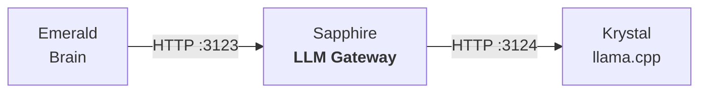

<p align="center">
  <picture>
    <source media="(prefers-color-scheme: dark)" srcset="images/logo.webp">
    
  </picture>
  <h1 align="center">Sapphire</h1>
  <p align="center">LLM gateway for the Luna Protocol ecosystem</p>
  <p align="center">
    <a href="https://github.com/protocol-luna/sapphire/blob/main/LICENSE">
      
    </a>
    <a href="https://www.python.org/">
      
    </a>
    <a href="https://fastapi.tiangolo.com/">
      
    </a>
    <a href="https://huggingface.co/BAAI/bge-small-en-v1.5">
      
    </a>
    <a href="https://github.com/protocol-luna">
      
    </a>
  </p>
</p>

Sapphire sits between Emerald (the brain) and Krystal (llama.cpp), handling session management, few-shot example injection, emotion classification, degenerate response detection, and prompt construction.



## How It Works

1. Emerald sends user messages to Sapphire's `/v1/respond` HTTP endpoint
2. Sapphire classifies the message using fastembed + BAAI-bge-small-en-v1.5 centroid embeddings (FUTILE/INTERESSANT + emotional valence/arousal)
3. Sapphire retrieves or creates a conversation session with per-channel history
4. Sapphire injects few-shot examples from YAML files into the conversation
5. Sapphire constructs the prompt with system message, few-shot examples, and conversation history
6. Sapphire calls Krystal's `/v1/chat/completions` with emotion-aware sampling parameters
7. Sapphire checks the response for degenerate patterns and retries if needed
8. Sapphire returns the response text (and optionally debug stats)

## Endpoints

### POST `/v1/respond`

Main endpoint called by Emerald.

**Request:**
```json
{
  "username": "User",
  "text": "hello how are you?",
  "session_id": "jade:123456",
  "stream": false,
  "debug": false
}
```

**Response (non-streaming):**
```json
{
  "text": "Hey! I'm good, how about you?",
  "label": "FUTILE",
  "backend": "http://127.0.0.1:3124",
  "valence": 0.12,
  "arousal": -0.04
}
```

### Streaming (`stream: true`)

When `stream: true` is set, Sapphire returns an SSE stream:

```
data: Hey
data: !
data:  I'm
data:  good
data: , how
data:  about
data:  you
data: ?
data: {"text":"Hey! I'm good, how about you?","label":"FUTILE",...}
data: [DONE]
```

### Other endpoints

- **POST `/v1/reset`** — Reset a session (or all sessions)
- **POST `/classify`** — Classify text without generating a response
- **GET `/emotion/{conv_key}`** — Current emotional state for a conversation
- **GET `/health`** — Health check with system status

## Features

### Emotion Classification

Each message is scored on two continuous axes:
- **Valence** (−1 to +1): negative to positive sentiment
- **Arousal** (−1 to +1): calm to aroused

### Emotion-Aware Sampling

Sapphire dynamically adjusts sampling parameters based on emotional state:

| Parameter | Formula | Range |
|-----------|---------|-------|
| Temperature | `clamp(0.7 + arousal × 0.3, 0.4, 1.0)` | Higher arousal = more randomness |
| Repeat penalty | `clamp(1.15 - valence × 0.1, 1.0, 1.3)` | Higher valence = less penalty |
| Mirostat entropy | `clamp(6.0 + arousal × 2.0, 3.0, 8.0)` | Higher arousal = more entropy |

### Session Management

Per-channel/user conversation history: max 20 messages, 600s TTL, configurable slots.

### Few-Shot Learning

Up to 5 example exchanges from `few_shot_examples.yml` are injected after the system prompt.

### Degenerate Response Detection

Regex-based detection of empty, too-short, or character-repetitive outputs. Non-streaming mode retries up to 2 times. Streaming mode discards degenerate output silently.

### Backend Routing

FUTILE messages → `KRYSTAL_GENERIC_URL` · INTERESSANT messages → `KRYSTAL_SEMANTIC_URL`

## Configuration

| Variable | Default | Description |
|----------|---------|-------------|
| `SAPPHIRE_PORT` | 3123 | HTTP port |
| `KRYSTAL_GENERIC_URL` | `http://127.0.0.1:3124` | Backend for FUTILE messages |
| `KRYSTAL_SEMANTIC_URL` | `http://127.0.0.1:3125` | Backend for INTERESSANT messages |
| `SAPPHIRE_BOT_NAME` | "Luna" | Bot persona name |
| `SAPPHIRE_EMOTION_DEADZONE` | 0.005 | Emotion update threshold |
| `SAPPHIRE_EMOTION_DECAY` | 0.85 | Emotion decay factor |
| `SAPPHIRE_FEW_SHOT_ENABLED` | true | Enable few-shot injection |
| `SAPPHIRE_LLM_MAX_RETRIES` | 2 | Degenerate retry count |

## Running

```bash
# Install
pip install -r requirements.txt

# Development
python server.py

# Production (PM2)
pm2 start
```
