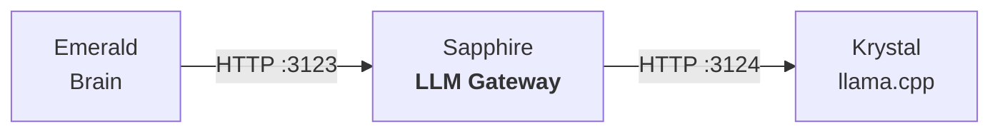

<p align="center">
  <picture>
    <source media="(prefers-color-scheme: dark)" srcset="images/logo.webp">
    
  </picture>
  <h1 align="center">Sapphire</h1>
  <p align="center">LLM gateway for the Luna Protocol ecosystem</p>
  <p align="center">
    <a href="https://github.com/protocol-luna/sapphire/blob/main/LICENSE">
      
    </a>
    <a href="https://www.python.org/">
      
    </a>
    <a href="https://fastapi.tiangolo.com/">
      
    </a>
    <a href="https://huggingface.co/BAAI/bge-small-en-v1.5">
      
    </a>
    <a href="https://github.com/protocol-luna">
      
    </a>
  </p>
</p>

Sapphire sits between Emerald (the brain) and Krystal (llama.cpp), handling session management, few-shot example injection, emotion classification, degenerate response detection, and prompt construction.



## How It Works

1. Emerald sends user messages to Sapphire's `/v1/respond` HTTP endpoint
2. Sapphire classifies the message using fastembed + BAAI-bge-small-en-v1.5 centroid embeddings (FUTILE/INTERESSANT + emotional valence/arousal)
3. Sapphire retrieves or creates a conversation session with per-channel history
4. Sapphire injects few-shot examples from YAML files into the conversation
5. Sapphire constructs the prompt with system message, few-shot examples, and conversation history
6. Sapphire calls Krystal's `/v1/chat/completions` with emotion-aware sampling parameters
7. Sapphire checks the response for degenerate patterns and retries if needed
8. Sapphire returns the response text (and optionally debug stats)

## Technical Overview

Sapphire is **~1,000 lines of Python** across 8 source files, built on FastAPI with uvicorn. It uses `fastembed` (BAAI/bge-small-en-v1.5, 384-dim) for text embeddings and `httpx` for async HTTP communication with Krystal.

### Source Map

| File | Lines | Role |
|------|-------|------|
| `server.py` | 80 | CLI entry point, centroid builder |
| `src/sapphire/server.py` | 509 | Main FastAPI app (all endpoints) |
| `src/sapphire/classifier.py` | 101 | Embedding centroid classifier |
| `src/sapphire/emotion.py` | 141 | Valence/arousal scoring + EMA state |
| `src/sapphire/sessions.py` | 70 | Session management with TTL & slot hashing |
| `src/sapphire/few_shot.py` | 34 | Few-shot example loading & injection |
| `src/sapphire/degenerate.py` | 19 | Degenerate output detection |
| `src/sapphire/proxy.py` | 105 | Krystal HTTP proxy with retry logic |

### Request Pipeline (`/v1/respond`)

For every message, Sapphire runs this pipeline:

```
1. Embed user text (384-dim vector via BGE-small)
2. Classify: cosine similarity to futile/interessant centroids
3. Score emotion: valence & arousal from pole centroids
4. Update EmotionState (exponential moving average)
5. Pick backend: FUTILE → GENERIC_URL, INTERESSANT → SEMANTIC_URL
6. Get/create session, append user message
7. Inject few-shot examples after system prompt
8. Map session_id → slot (Java-style string hash)
9. Compute sampling params from valence/arousal
10. Call Krystal with retry (up to 3 attempts)
11. Check degenerate output → retry or discard
12. Truncate user leak (strip after \nUser:)
13. Save assistant response to session
14. Return RespondResult (with optional debug stats)
```

### Embedding Centroid Classification (`src/sapphire/classifier.py`)

Sapphire uses a custom centroid-based classifier instead of a neural classifier:

**Training:** ~500 "futile" examples and ~540 "interessant" examples (from `examples.yml`) are embedded via BGE-small. The embeddings are averaged per category to produce two 384-dim centroid vectors. Centroids are saved to `centroids/classifier_centroids.npz`.

**Classification:** Each incoming message is embedded once. Cosine similarity is computed against both centroids:

```
sim_futile = cos(embedding, futile_centroid)
sim_interessant = cos(embedding, interessant_centroid)
label = "INTERESSANT" if (sim_i - sim_f) > 0 else "FUTILE"
confidence = |sim_i - sim_f|
```

**Centroid examples include:**
- **FUTILE:** Greetings, casual reactions, dismissals, filler words, memes, farewells
- **INTERESSANT:** Technical questions, science, philosophy, personal sharing, emotional content, ethical dilemmas

### Emotion Scoring (`src/sapphire/emotion.py`)

Continuous two-axis emotion model using the same embedding approach:

**Pole centroids** (from `examples_emotion.yml`):
- **Positive** (84 samples): joy, gratitude, excitement
- **Negative** (79 samples): anger, frustration, sadness
- **High arousal** (87 samples): panic, urgency, excitement
- **Low arousal** (121 samples): calm, indifference, sleepiness

**Scoring:**
```
valence = cos(emb, positive) - cos(emb, negative)
arousal = cos(emb, high_arousal) - cos(emb, low_arousal)
```

Results are in [-1, 1] range.

**EmotionState (EMA):** Per-conversation exponential moving average:
```
state = state × decay + delta × (1 - decay)
```
- `decay` = 0.85 (configurable)
- `deadzone` = 0.005: signals below this threshold are zeroed out to avoid drift
- State is updated per-message and persists across the conversation

### Emotion-Aware Sampling Parameters

```python
temperature  = clamp(0.7 + arousal × 0.3, 0.4, 1.0)
                     # ↑ arousal = more randomness

repeat_penalty = clamp(1.15 - valence × 0.1, 1.0, 1.3)
                     # ↑ valence = less repetition suppression

# If mirostat enabled:
mirostat_ent = clamp(5.0 + arousal × 2.0, 3.0, 8.0)
                     # ↑ arousal = more entropy
```

This creates a dynamic personality: happy/engaged → more creative, less repetitive. Sad/calm → more conservative, repetitive.

### Session Management (`src/sapphire/sessions.py`)

- **TTL:** Sessions expire after 600s of inactivity
- **Max history:** 20 messages per session (pruned to oldest)
- **Slot hashing:** Session IDs are hashed using Java-style `String.hashCode()` to deterministically map conversations to llama.cpp context slots
- **Stale cleanup:** Runs on every request to remove expired sessions

### Few-Shot Injection (`src/sapphire/few_shot.py`)

5 example exchanges from `few_shot_examples.yml` are loaded at startup. On each request, they're formatted as OpenAI messages and injected immediately after the system prompt — before conversation history. This gives the model a consistent persona seed every time.

Example few-shot (from `few_shot_examples.yml`):
```
User: hey
Assistant: nm just chillin, u
User: same tbh, wanna play sum?
Assistant: sure
```

### Degenerate Detection (`src/sapphire/degenerate.py`)

Simple regex-based detection. Returns `True` if any of:
- Empty after stripping
- Length < 2 characters
- No whitespace, length < 15, no sentence-ending punctuation

Covers: empty responses, single characters, character-repetitive garbage like `"aaaaaa"`.

### Krystal Proxy (`src/sapphire/proxy.py`)

- **Non-streaming:** `call_backend_once()` → full JSON response → `is_degenerate_output()` check → retry up to `LLM_MAX_RETRIES` (default 2) times
- **Streaming:** SSE passthrough. Collects all delta chunks, checks degenerate at end, yields metadata or `[DONE]`
- If degenerate after all retries, returns the last response anyway (better than nothing)

### User Leak Truncation

```python
def truncate_user_leak(text):
    # Strips everything after \nUser: (prevents model from writing fake user messages)
    return re.sub(r"\nUser\s*:", "", text)
```

### Endpoints

#### `POST /v1/respond`
Main endpoint. Full pipeline with classification, session, few-shot, and retry.

#### `POST /v1/chat/completions`
Transparent proxy to Krystal (OpenAI-compatible format). No session/few-shot/degenerate logic — just routing and streaming passthrough.

#### `POST /v1/reset`
Reset specific or all sessions.

#### `POST /classify`
Classification-only endpoint for diagnostics.

#### `GET /emotion/{conv_key}`
Current emotional state for a conversation.

#### `GET /health`
System status with backend URLs and active session count.

### Data Files

| File | Content |
|------|---------|
| `examples.yml` | 1,123 lines of futile/interessant classification examples |
| `examples_emotion.yml` | 367 lines of emotion pole examples |
| `few_shot_examples.yml` | 5 example exchanges for persona seeding |
| `centroids/classifier_centroids.npz` | Precomputed classification centroids |
| `centroids/emotion_centroids.npz` | Precomputed emotion centroids |

## Configuration

| Variable | Default | Description |
|----------|---------|-------------|
| `SAPPHIRE_PORT` | 3123 | HTTP port |
| `KRYSTAL_GENERIC_URL` | `http://127.0.0.1:3124` | FUTILE backend |
| `KRYSTAL_SEMANTIC_URL` | `http://127.0.0.1:3124` | INTERESSANT backend |
| `SAPPHIRE_BOT_NAME` | "Luna" | Bot persona name |
| `SAPPHIRE_EMOTION_DEADZONE` | 0.005 | Emotion update threshold |
| `SAPPHIRE_EMOTION_DECAY` | 0.85 | Emotion decay factor |
| `SAPPHIRE_FEW_SHOT_ENABLED` | true | Enable few-shot injection |
| `SAPPHIRE_LLM_MAX_RETRIES` | 2 | Degenerate retry count |
| `SAPPHIRE_MIROSTAT_ENABLED` | true | Enable mirostat sampling |

## Running

```bash
# Install
pip install -r requirements.txt

# Build centroids (first time only, auto-computed on startup)
python server.py --build-centroids

# Development
python server.py

# Production (PM2)
pm2 start
```
